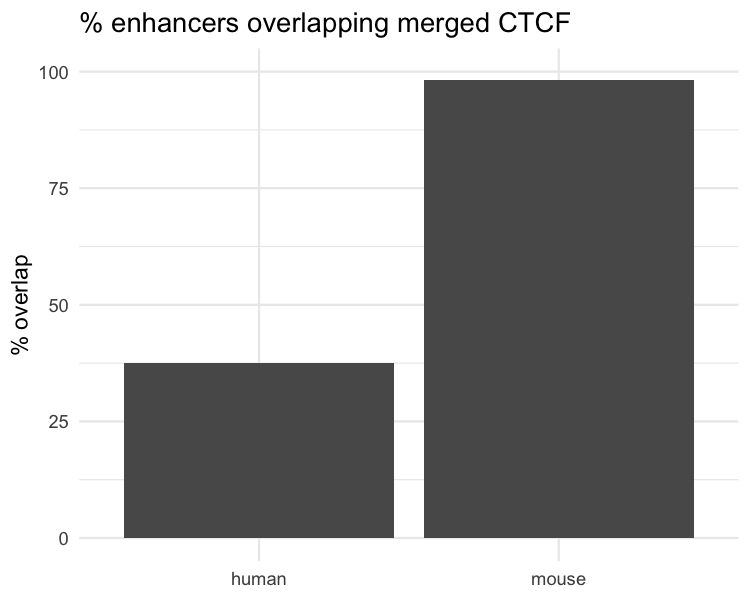

## Sprint 1 — Human vs Mouse

**Enhancers (union):** Human = 4,067,523, Mouse = 1,438,844

**CTCF (merged):** Human = 1,310,125, Mouse = 2,007,813

**Enhancers overlapping CTCF:** Human = 1,529,431 (37.6%), Mouse = 1,414,329 (98.3%)

