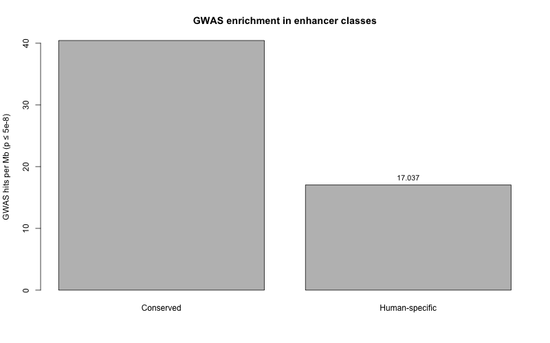

# End-goal demo: GWAS enrichment in enhancer classes

- GWAS file: `data/gwas/clean/bmi.parquet`
- Significant variants: 31,910
- Conserved span: 4.5 Mb; hits: 183 (40.435 / Mb)
- Human-specific span: 622.9 Mb; hits: 10,613 (17.037 / Mb)

