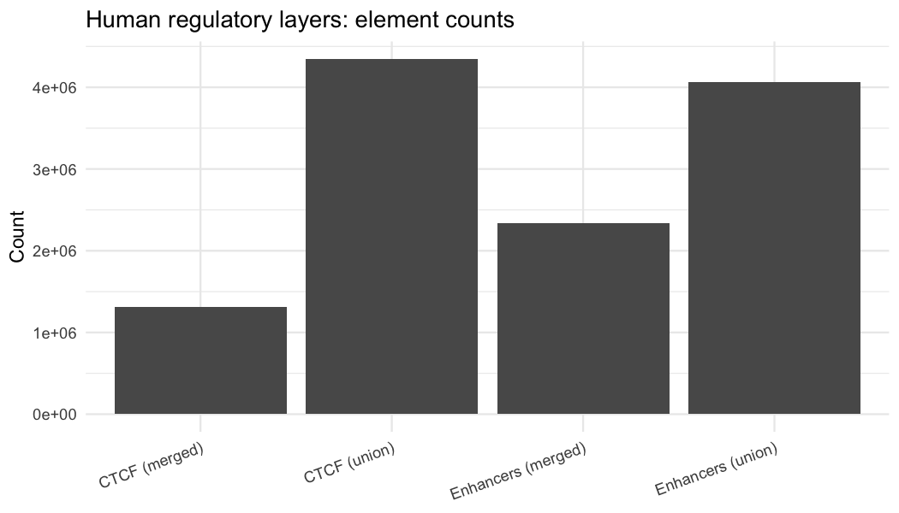

## Sprint 1 — Human Regulatory Layers Summary

**Data sources (human):**
- Enhancers: SCREEN cCREs (All) and ELS (enhancer-like)
- CTCF: ENCODE CTCF ChIP-seq, merged across experiments (your union/merged builds)

### Element counts
- Enhancers (union): **4,067,523**
- Enhancers (merged): **2,333,736**
- CTCF (merged): **1,310,125**
- CTCF (union): **4,345,571**

### Enhancer composition (union)

### Enhancer–CTCF overlap
- Enhancers overlapping any CTCF merged interval: **1,529,431 / 4,067,523 (37.6%)**

_This page is auto-generated from `processing_scripts/sprint1_human_summary.R`._
